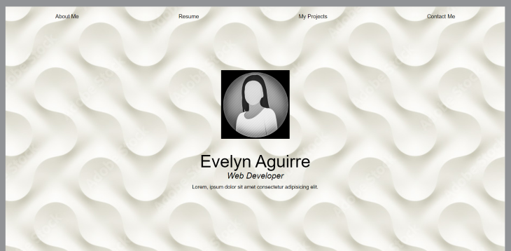

# My Portfolio
## Module 2 Challenge

### Purpose

This is a preliminary portfolio page designed using HTML and CSS.

It includes links to two live websites with placekeepers for future projects. All navigational links lead to their corresponding section of the application. The layout is responsive to various screen sizes and devices.

### Built With
- HTML
- CSS

### Website

https://evelynaguirreortiz.github.io/my-portfolio-challenge-utsa-bc-02-2022/

